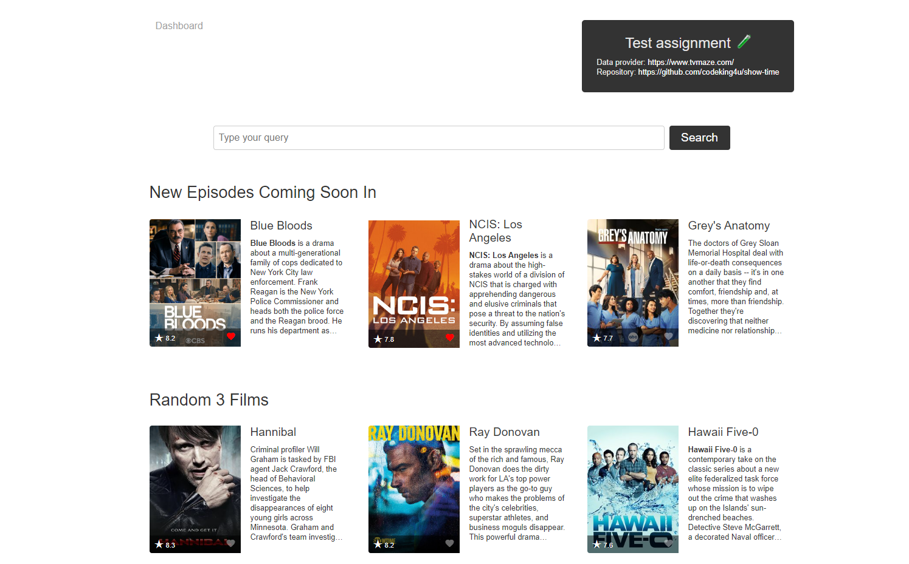
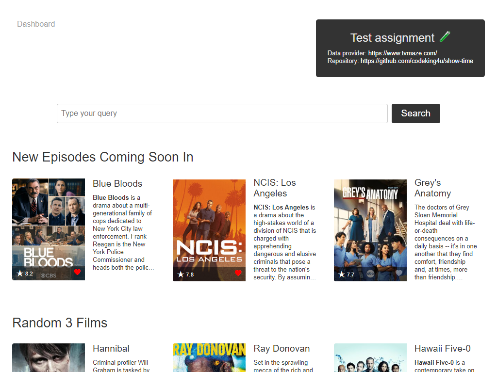
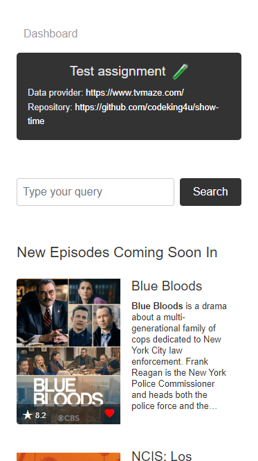

# SHOW TIME 🎬

Web Application to display TV Shows and their details information like Episodes, timings, ratings etc. Users can search the TV Show and also mark them as their favourite.

### Preview

#### Desktop view



---

#### Tablet view



---

#### Mobile view



---

## Technologies used:

1. **Vue 3** with TypeScript for UI.
2. **Vuex** for State Management.
3. **Vitest** - a lightweight and fast test runner for Vue applications.
4. **Vite** - Build tool.
5. **Vue Router** - To manage routes and navigations.
6. **DOMPurify** - For sanitizing HTML.
7. **ESLint** - Linting utility.
8. **Axios** - Handle HTTP requests.

## Instructions to run the Application:

1. Install all dependencies

```sh
npm install
```

2. Start the Application

```sh
npm run dev
```

3. For testing

### `npm run test:unit`

4. For building

### `npm run build`
